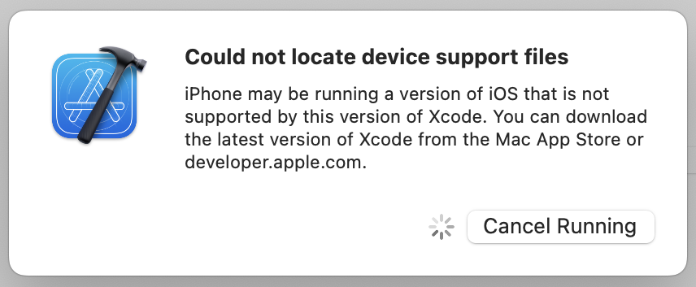

# iPhoneOSDeviceSupport
Xcode iPhoneOS DeviceSupport (6.0 - 16.6)
[[WatchOS](https://github.com/filsv/watchOSDeviceSupport) | [tvOS](https://github.com/filsv/TVOSDeviceSupport)];

> [!WARNING]
> <strong>iOS 17+ Workaround (Xcode 14+ required):</strong><br>
> In the terminal run:
> </br>
> ```shell
> defaults write com.apple.dt.Xcode DVTEnableCoreDevice enabled
> ```
> 
> "Then restart Xcode 14 the iOS 17 device will show up in Xcode like below and you can run and debug the app as usual. (You may need to go to Devices and Simulators to pair/trust the device)"
>
> "I have Xcode 15 beta installed alongside Xcode 14, I'm not sure if that's required or not."
> 
> [Based on this](https://forums.developer.apple.com/forums/thread/730947?answerId=758061022#758061022)

**Most recent releases:**</br>
iOS 16.6 - [Download](https://github.com/filsv/iOSDeviceSupport/raw/master/16.6.zip) </br>
iOS 16.5.1 [Workaround](https://github.com/filsv/iOSDeviceSupport/issues/170#issuecomment-1625668545) </br>
iOS 16.5 - [Download](https://github.com/filsv/iOSDeviceSupport/raw/master/16.5.zip) </br>
iOS 16.4 - [Download](https://github.com/filsv/iOSDeviceSupport/raw/master/16.4.zip) </br>
iOS 16.3 - [Download](https://github.com/filsv/iOSDeviceSupport/raw/master/16.3.zip) </br>
iOS 16.2 - [Download](https://github.com/filsv/iOSDeviceSupport/raw/master/16.2.zip) </br>
iOS 16.1 - [Download](https://github.com/filsv/iOSDeviceSupport/raw/master/16.1.zip) </br>
iOS 16.0 - [Download](https://github.com/filsv/iOSDeviceSupport/raw/master/16.0.zip) </br>

**iOS 15+**</br>
iOS 15.8 - [Workaround](https://github.com/master131/iFakeLocation/issues/162#issuecomment-1793576376) </br>
iOS 15.7 - [Download](https://github.com/filsv/iOSDeviceSupport/raw/master/15.7.zip) </br>
iOS 15.6 - [Download](https://github.com/filsv/iOSDeviceSupport/raw/master/15.6.zip) </br>
iOS 15.5 - [Download](https://github.com/filsv/iOSDeviceSupport/raw/master/15.5.zip) </br>
iOS 15.4 - [Download](https://github.com/filsv/iOSDeviceSupport/raw/master/15.4.zip) </br>
iOS 15.3 - [Download](https://github.com/filsv/iOSDeviceSupport/raw/master/15.3.zip) </br>
iOS 15.2 - [Download](https://github.com/filsv/iOSDeviceSupport/raw/master/15.2.zip) </br>
iOS 15.1 - [Download](https://github.com/filsv/iOSDeviceSupport/raw/master/15.1.zip) </br>
iOS 15.0 - [Download](https://github.com/filsv/iOSDeviceSupport/raw/master/15.0.zip) </br>

**iOS 14+**</br>
iOS 14.7.1 - [Download](https://github.com/filsv/iOSDeviceSupport/raw/master/14.7.1.zip) </br>
iOS 14.7 - [Download](https://github.com/filsv/iOSDeviceSupport/raw/master/14.7.zip) </br>
iOS 14.6 - [Download](https://github.com/filsv/iOSDeviceSupport/raw/master/14.6.zip) </br>
iOS 14.5 - [Download](https://github.com/filsv/iOSDeviceSupport/raw/master/14.5.zip) </br>
iOS 14.4 - [Download](https://github.com/filsv/iOSDeviceSupport/raw/master/14.4.zip) </br>
iOS 14.3 - [Download](https://github.com/filsv/iOSDeviceSupport/raw/master/14.3.zip) </br>
iOS 14.2 - [Download](https://github.com/filsv/iOSDeviceSupport/raw/master/14.2.zip) </br>
iOS 14.1 - [Download](https://github.com/filsv/iOSDeviceSupport/raw/master/14.1.zip) </br>
iOS 14.0 - [Download](https://github.com/filsv/iOSDeviceSupport/raw/master/14.0.zip) </br>

**iOS 13+**</br>
iOS 13.7 - [Download](https://github.com/filsv/iOSDeviceSupport/raw/master/13.7.zip) </br>
iOS 13.6 - [Download](https://github.com/filsv/iOSDeviceSupport/raw/master/13.6.zip) </br>
iOS 13.5 - [Download](https://github.com/filsv/iOSDeviceSupport/raw/master/13.5.zip) </br>
iOS 13.4 - [Download](https://github.com/filsv/iOSDeviceSupport/raw/master/13.4.zip) </br>
iOS 13.3 - [Download](https://github.com/filsv/iOSDeviceSupport/raw/master/13.3.zip) </br>
iOS 13.2 - [Download](https://github.com/filsv/iOSDeviceSupport/raw/master/13.2.zip) </br>
iOS 13.1 - [Download](https://github.com/filsv/iOSDeviceSupport/raw/master/13.1.zip) </br>
iOS 13.0 - [Download](https://github.com/filsv/iOSDeviceSupport/raw/master/13.0.zip) </br>

**iOS 12+**</br>
iOS 12.4 - [Download](https://github.com/filsv/iOSDeviceSupport/raw/master/12.4.zip) </br>
iOS 12.4 (16G73) - [Download](https://github.com/filsv/iOSDeviceSupport/raw/master/12.4%20(16G73).zip) </br>
iOS 12.3 - [Download](https://github.com/filsv/iOSDeviceSupport/raw/master/12.3.zip) </br>
iOS 12.2 - [Download](https://github.com/filsv/iOSDeviceSupport/raw/master/12.2.zip) </br>
iOS 12.2 (16E5181e) - [Download](https://github.com/filsv/iOSDeviceSupport/raw/master/12.1%20(16B91).zip) </br>
iOS 12.1 - [Download](https://github.com/filsv/iOSDeviceSupport/raw/master/12.1.zip) </br>
iOS 12.1 (16B91) - [Download](https://github.com/filsv/iOSDeviceSupport/raw/master/12.1%20(16B91).zip) </br>
iOS 12.1 (16B5059d) - [Download](https://github.com/filsv/iOSDeviceSupport/raw/master/12.1%20(16B5059d).zip) </br>
iOS 12.0 - [Download](https://github.com/filsv/iOSDeviceSupport/raw/master/12.0.zip) </br>
iOS 12.0 (16A366) - [Download](https://github.com/filsv/iOSDeviceSupport/raw/master/12.0%20(16A366).zip) </br>

**iOS 11+**</br>
iOS 11.4 - [Download](https://github.com/filsv/iOSDeviceSupport/raw/master/11.4.zip) </br>
iOS 11.4.1 (15G77) - [Download](https://github.com/filsv/iOSDeviceSupport/raw/master/11.4.1%20(15G77).zip) </br>
iOS 11.4 (15F79) - [Download](https://github.com/filsv/iOSDeviceSupport/raw/master/11.4%20(15F79).zip) </br>
iOS 11.4 (15F5061c) - [Download](https://github.com/filsv/iOSDeviceSupport/raw/master/11.4%20(15F5061c).zip) </br>
iOS 11.4 (15F5037c) - [Download](https://github.com/filsv/iOSDeviceSupport/raw/master/11.4%20(15F5037c).zip) </br>
iOS 11.3 - [Download](https://github.com/filsv/iOSDeviceSupport/raw/master/11.3.zip) </br>
iOS 11.3 (15E5178d) - [Download](https://github.com/filsv/iOSDeviceSupport/raw/master/11.3%20(15E5178d).zip) </br>
iOS 11.2 - [Download](https://github.com/filsv/iOSDeviceSupport/raw/master/11.2.zip) </br>
iOS 11.1 - [Download](https://github.com/filsv/iOSDeviceSupport/raw/master/11.1.zip) </br>
iOS 11.0 - [Download](https://github.com/filsv/iOSDeviceSupport/raw/master/11.0.zip) </br>

**iOS 10+**</br>
iOS 10.3 - [Download](https://github.com/filsv/iOSDeviceSupport/raw/master/10.3.zip) </br>
iOS 10.3 (14E5265a) - [Download](https://github.com/filsv/iOSDeviceSupport/raw/master/10.3%20(14E5265a).zip) </br>
iOS 10.3 (14E5230d) - [Download](https://github.com/filsv/iOSDeviceSupport/raw/master/10.3%20(14E5230d).zip) </br>
iOS 10.2 - [Download](https://github.com/filsv/iOSDeviceSupport/raw/master/10.2.zip) </br>
iOS 10.1 - [Download](https://github.com/filsv/iOSDeviceSupport/raw/master/10.1.zip) </br>
iOS 10.0 - [Download](https://github.com/filsv/iOSDeviceSupport/raw/master/10.0.zip) </br>


**iOS 9+**</br>
iOS 9.3 - [Download](https://github.com/filsv/iOSDeviceSupport/raw/master/9.3.zip) </br>
iOS 9.2 - [Download](https://github.com/filsv/iOSDeviceSupport/raw/master/9.2.zip) </br>
iOS 9.1 - [Download](https://github.com/filsv/iOSDeviceSupport/raw/master/9.1.zip) </br>
iOS 9.0 - [Download](https://github.com/filsv/iOSDeviceSupport/raw/master/9.0.zip) </br>
</br>

> [!IMPORTANT]
> ** How to **:
> 1) Download version you need listed above;
> 2) Unzip it;
> 3) Close Xcode;
> 4) Copy and paste unziped folder by path:
>
> ```/Applications/Xcode.app/Contents/Developer/Platforms/iPhoneOS.platform/DeviceSupport/```
>
> <p align="left">Hierarchy:</p>
>
> 
>
> 5) Disconnect any physical target device (iPhone, iPad, etc.)
> 6) Reopen Xcode;
> 7) (Optional) Connect physical target device
>
> - [Thanks to @unfor19 for updating this [5-7] steps]</br>
> Text representation of the folder hierarchy:
> 
> ```
> Xcode-beta.app
> ├── Contents
> │   ├── _CodeSignature
> │   ├── Applications
> │   ├── Developer
> │   │   ├── Applications
> │   │   ├── Library
> │   │   ├── Makefiles
> │   │   ├── Platforms
> │   │   │   ├── AppleTVOS.platform
> │   │   │   ├── AppleTVSimulator.platform
> │   │   │   ├── iPhoneOS.platform
> │   │   │   │   ├── _CodeSignature
> │   │   │   │   ├── Developer
> │   │   │   │   ├── DeviceSupport
> │   │   │   │   │   ├── 8.0
> │   │   │   │   │   ├── 8.1
> │   │   │   │   │   ├── 8.2
> │   │   │   │   │   ├── 8.3
> │   │   │   │   │   ├── 8.4
> │   │   │   │   │   ├── 9.0
> │   │   │   │   │   ├── 9.1
> │   │   │   │   │   ├── 9.2
> │   │   │   │   │   ├── 9.3
> │   │   │   │   │   ├── 10.0
> │   │   │   │   │   ├── 10.1
> │   │   │   │   │   ├── 10.2
> │   │   │   │   │   ├── 10.3
> │   │   │   │   │   ├── 11.0
> │   │   │   │   │   ├── 11.1
> │   │   │   │   │   ├── 11.2
> │   │   │   │   │   ├── 11.3
> │   │   │   │   │   ├── 11.4
> │   │   │   │   │   ├── 12.0
> │   │   │   │   │   ├── 12.1
> │   │   │   │   │   ├── 12.2
> │   │   │   │   │   ├── 12.3
> │   │   │   │   │   ├── 13.0
> │   │   │   │   │   ├── * PUT VERSION HERE (unzip and put it here) *
> │   │   │   ├── icon.icns
> │   │   │   ├── info.plist
> │   │   │   ├── Library
> │   │   │   ├── usr
> │   │   │   ├── version.plist
> │   │   │   ├── MacOSX.platform
> │   │   │   ├── WatchOS.platform
> │   │   │   ├── WatchSimulator.platform
> │   │   ├── Toolchains
> │   │   ├── Tools
> │   │   ├── usr
> │   ├── Frameworks
> ```
> Path: ```Xcode-beta.app/Contents/Developer/Platforms/iPhoneOS.platform/DeviceSupport/NEW_VERSION_FOLDER```
> ```Xcode-beta.app/Contents/Developer/Platforms/iPhoneOS.platform/DeviceSupport/16.5```
>
> Thanks to @marlon-sousa for this idea ;)

> [!NOTE]
> **Could not locate device support files**
> 
> 
> 
> 
> If you see similar image, follow this:
> 
> ```diff
> Turn on "Developer mode" on your iPhone (Settings -> Privacy & Security -> Developer Mode).
> ```
> [Resolution](https://github.com/filsv/iOSDeviceSupport/issues/147)</br>

> **Note**
> 
> If you need upper version of the support files less than 1 iteration (eg. You have "15.0" and you need "15.1.5" - You can simply rename folder from "15.0" to "15.1.5" and it should work or try to use next iteration version of the support files, if exists "15.2", otherwise open an issue);
> 

> [!CAUTION]
> Xcode 12 now encrypts the connection between Xcode and paired devices, protecting against an attacker in a privileged network position executing arbitrary code > on connected iOS, iPadOS, watchOS, or tvOS devices during a remote debug session. (60386733)
>
> These security benefits are available when Xcode 12 connects to devices running iOS 14, iPadOS 14, watchOS 7, tvOS 14, or later versions.
> These OS versions also refuse debugger connections from older Xcode releases.
> Xcode 12 continues to support debugging for older OS versions, but without the new encryption.
> [Comment](https://github.com/filsv/iPhoneOSDeviceSupport/issues/69#issuecomment-694508149) </br>

```diff
For debugging in iOS 14 devices you need at least Xcode 12.
Cause Apple have updated their code for debugging apps on iOS 14 and that is not compatible on older version of Xcode.
```
[Comment](https://github.com/filsv/iPhoneOSDeviceSupport/issues/76#issuecomment-735321146)

🚩🚩🚩🚩🚩🚩🚩🚩🚩🚩🚩🚩🚩🚩🚩🚩🚩🚩🚩🚩🚩🚩
```diff
- To get iOS 13.(version) [example iOS 13.5.1] works with iOS 14.0, just rename a folder.
- Like this: 13.5 ~> 13.5.1 (17F80);
```

**How to support iOS 14 devices with Xcode 11.5+:**</br> (tested with 11.6 (11E708))

**[Download iOS 14.2 Support Files](/14.2.zip)** </br>
**Unzip it**</br>
**Put unzipped folder into path:**</br>
```/Applications/Xcode.app/Contents/Developer/Platforms/iPhoneOS.platform/DeviceSupport/```</br>
**Restart Xcode**</br>

Xcode usage license - [Link](https://www.apple.com/legal/sla/docs/xcode.pdf).
